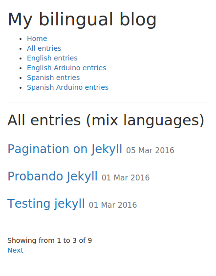
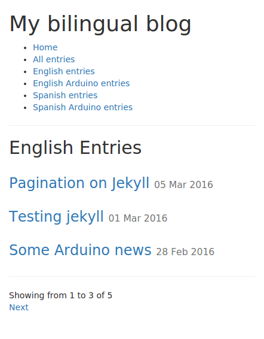
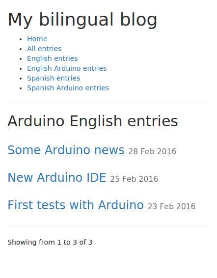

Yet another multilingual pagination plugin for Jekyll
----------
### With category support ###
This is an attempt to have a **simple** multilingual pagination plugin that supports categories.

#### Usage ####
Copy ```_plugins/LanguageAndCategoriesPagination.rb``` to your ```_plugins``` folder

Create a ```index.html``` file for each required pagination, as an example ```entries_arduino/index.html``` would act as the starting point for the Arduino category.

Each starting point must be called ```index.html``` and it should contain a ```posts_per_page``` variable on the *Front Matter* header. Please note: do not specify a permalink on the starting points.

To enable language pagination, specify a ```language``` variable on the *Front Matter* of the starting point and in any post that should be included.

To enable category pagination, specify a ```category``` variable on the *Front Matter* of the starting point and in any related post.

Starting point example
```
---
layout: default
title: Arduino English entries
category: arduino
language: en
posts_per_page: 3
---

```

Pagination loop example ```entries.html```

```
<h2>{{ page.title }}</h2>


	{{ post.title }}


Showing from {{ page.pagination.from }} to {{ page.pagination.to }} of {{ page.pagination.total_posts }}

<a href="{{page.pagination.previous_page_path}}">Previous</a>

<a href="{{page.pagination.next_page_path}}">Next</a>
```

Post example
```
---
layout: post
title:  "Some Arduino news"
date:   2016-02-28 13:00:00 +1300
categories: electronic arduino diy
language: en
---
Ut non enim eleifend felis pretium feugiat. Phasellus ullamcorper ipsum rutrum nunc.
```

#### Run the full example ####
```
git clone https://github.com/cristianszwarc/JekyllLanguageAndCategoriesPagination.git
cd JekyllLanguageAndCategoriesPaginaon/
jekyll serve
```
then open http://localhost:4000/

##Screenshots##

*Only pagination, all posts*


*Filtered by language*


*Filtered by language and category*

